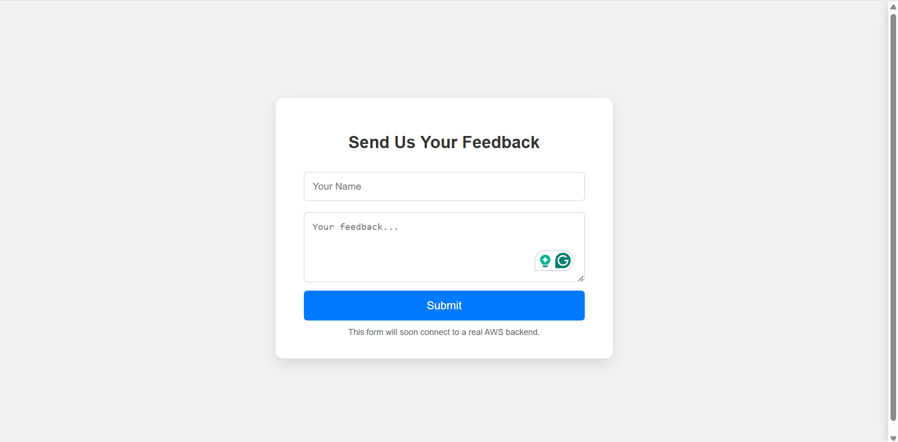
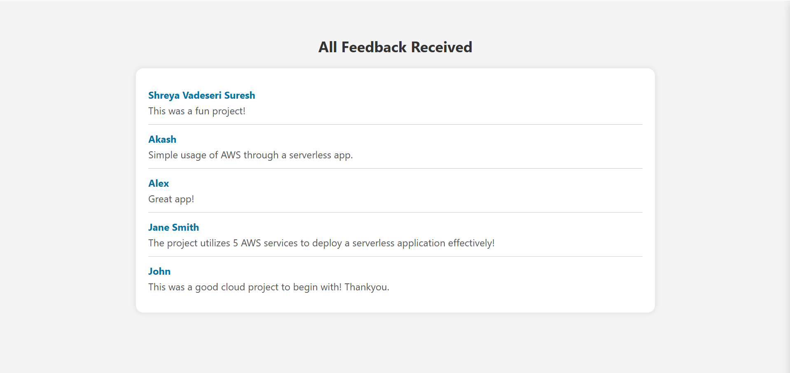

# Serverless Feedback Collection App

A fully serverless web application for collecting and viewing user feedback using AWS services. This project is designed to operate entirely within the AWS Free Tier and demonstrates the integration of Amazon S3, AWS Lambda, API Gateway, and DynamoDB in a practical use case.

---

## 📌 Features

- HTML form to collect user feedback
- Viewer page to display stored feedback entries
- RESTful APIs built with API Gateway
- Scalable, pay-as-you-go architecture
- No server provisioning or infrastructure management required

---

## 🛠️ Built With

| Service          | Purpose                                       |
|------------------|-----------------------------------------------|
| Amazon S3        | Host static website frontend                  |
| AWS Lambda       | Backend logic to process and return feedback  |
| Amazon API Gateway | Manage HTTP endpoints for Lambda invocation |
| Amazon DynamoDB  | NoSQL data storage for feedback entries        |
| IAM Roles        | Secure permission boundaries between services |

---

## 📁 Project Structure

```
project-root/
├── index.html              # Feedback submission form
├── view-feedback.html      # Feedback viewing dashboard
└── README.md               # Project documentation and instructions
```

---

## 🚀 Getting Started

### Prerequisites
- AWS Free Tier account
- IAM user with admin privileges

### 1. Set Up S3 Bucket
- Go to the S3 Console
- Create a bucket named `shreya-feedback-app`
- Enable **Static Website Hosting** under the Properties tab
- Uncheck "Block all public access" under Permissions
- Upload `index.html` and `view-feedback.html`
- Set a bucket policy to make objects publicly readable

```json
{
  "Version": "2012-10-17",
  "Statement": [
    {
      "Sid": "PublicReadGetObject",
      "Effect": "Allow",
      "Principal": "*",
      "Action": "s3:GetObject",
      "Resource": "arn:aws:s3:::shreya-feedback-app/*"
    }
  ]
}
```

### 2. Set Up DynamoDB Table
- Go to DynamoDB Console
- Click **Create Table**
- Table name: `FeedbackTable`
- Partition key: `id` (type: String)
- Leave everything else as default (On-demand capacity mode)

### 3. Create Lambda Functions
#### `submitFeedback`
- Python runtime
- Parses JSON from API
- Saves `id`, `name`, `feedback` to `FeedbackTable`

#### `getFeedback`
- Scans DynamoDB table
- Returns feedback records as JSON

### 4. Assign IAM Roles
- Go to IAM Console
- Find execution roles for each Lambda function
- Attach the `AmazonDynamoDBFullAccess` or `ReadOnlyAccess` as needed

### 5. Create REST API in API Gateway
- Create a new REST API named `feedbackApi`
- Add a resource `/feedback`
- Create two methods under `/feedback`:
  - `POST` method → linked to `submitFeedback`
  - `GET` method → linked to `getFeedback`
- Enable **CORS** for both methods

### 6. Deploy API Gateway
- Choose **Actions → Deploy API**
- Create a new stage: `prod`
- Save the generated Invoke URL

### 7. Integrate API with Frontend
In both HTML files:
- Replace placeholder `apiUrl` in the JavaScript with your actual deployed URL

```javascript
const apiUrl = 'https://your-api-id.execute-api.region.amazonaws.com/prod/feedback';
```

- Re-upload the updated HTML files to your S3 bucket

---

## 📷 Screenshots




---

## ✅ Completed Tasks

- [x] Created and hosted frontend on S3
- [x] Configured public access and website hosting
- [x] Built and deployed two Lambda functions
- [x] Set up API Gateway with CORS support
- [x] Connected frontend to API
- [x] Stored and retrieved feedback from DynamoDB
- [x] Verified Free Tier compatibility and CORS resolution

---

## 🧠 Lessons Learned

- How to create and link AWS Lambda functions with API Gateway
- Managing public access and static hosting on S3
- Writing and deploying Python code in Lambda
- Real-world CORS debugging and policy management
- IAM permissions for secure service communication

---

## 📌 Future Improvements

- Add timestamps for feedback entries
- Add user authentication for admin-only viewer access
- Use Amazon SES to email new feedback alerts
- Use pagination or filters in the viewer dashboard
- Store user email (optional) with verification

---

## 👤 Author

**Shreya Vadeseri Suresh**  
[LinkedIn Profile](https://www.linkedin.com/in/shreyavadeseri)

---

## 📜 License

This project is open-source and free to use under the MIT License.
